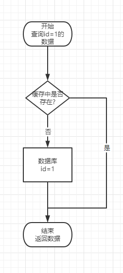

**前言**

在加入了缓存之后的一个数据访问流程应该是如下图所示



**什么是缓存雪崩？**

- 概念

```
缓存雪崩就是存放在缓存中的数据同一时刻大面积失效，用户的请求全部都打到了数据库，数据库压力增大,甚至可能造成数据库崩溃
```

- 解决办法

```
在缓存数据的时候，缓存的失效时间设置成随机值，这样同一时刻缓存不会大面积失效
```

**什么是缓存穿透？**

- 概念

```
缓存穿透就是知道我们数据肯定不存在的值，例如我们的id都是大于1的，但是某些人使用工具不停的发送id=-1的数据进行查询，
这时我们的缓存中没有缓存这样的数据，所有的请求都会打到数据库，也可能造成数据库奔溃
```

- 解决办法

```
1. 缓存不存在的数据并设置较短的失效时间例如30s，这样做是为了保证有的id的数据还没入库，但是后面可能会入库，在后续操作中能进行查询
2. 对于一定不存在的数据，例如id=-1的这种数据，可以加逻辑判断如果数据不合法直接返回，缓存和数据库都不走
3. 使用布隆过滤器过滤数据(布隆过滤器说数据不存在那就一定不存在，
说存在，实际数据可能不存在，可能会存在误判，但是针对不存在的数据，不处理很符合我们这里的场景)
4. nginx限制相同ip的用户每秒访问的次数，可疑的ip请求，直接拉黑
```

[布隆过滤器你需要知道的](https://mp.weixin.qq.com/s/BdwZViiAqnFhCde4ZsxwPg)

**什么是缓存击穿?**

- 概念
```
注意缓存穿透和缓存击穿的区别！！！！
缓存穿透是指：数据不存在，导致数据全部打到数据库
缓存击穿是指，数据的访问量很大，但是数据在某一刻过期了，对这一条数据的大量访问请求都打到了数据库，例如微博一个热点新闻，该新闻设置了过期时间2小时，
当2小时到了，这个热点新闻失效的一瞬间，还有成千上万的请求要访问这个数据，发现缓存过期了，请求直接打到数据库了，导致数据库压力激增
```

- 解决办法
```
设置热点数据永不失效
```