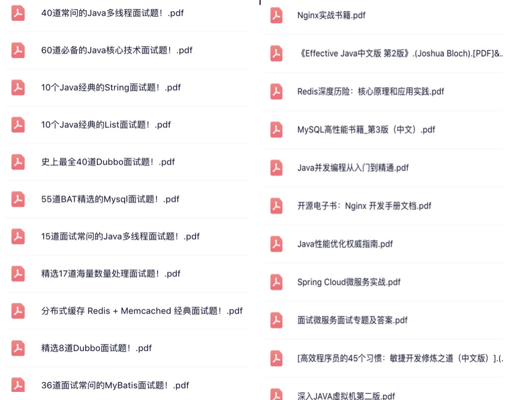

#### 美团一面面经

**最长连续子序列**

[力扣最长连续子序列](https://leetcode.cn/problems/longest-consecutive-sequence/solution/zui-chang-lian-xu-xu-lie-by-leetcode-solution/)

**对象判活**

```
判断一个对象是否存活有两种方法:
1. 引用计数法
所谓引用计数法就是给每一个对象设置一个引用计数器，每当有一个地方引用这个对象
时，就将计数器加一，引用失效时，计数器就减一。当一个对象的引用计数器为零时，说
明此对象没有被引用，也就是“死对象”,将会被垃圾回收.
引用计数法有一个缺陷就是无法解决循环引用问题，也就是说当对象 A 引用对象 B，对象
B 又引用者对象 A，那么此时 A,B 对象的引用计数器都不为零，也就造成无法完成垃圾回
收，所以主流的虚拟机都没有采用这种算法。
2.可达性算法(引用链法)
该算法的思想是：从一个被称为 GC Roots 的对象开始向下搜索，如果一个对象到 GC
Roots 没有任何引用链相连时，则说明此对象不可用。
在 java 中可以作为 GC Roots 的对象有以下几种: 
-  虚拟机栈中引用的对象
-  方法区类静态属性引用的对象
-  方法区常量池引用的对象
-  本地方法栈 JNI 引用的对象
```

 **哪些GC算法**

```
1. 标记-清除:
这是垃圾收集算法中最基础的，根据名字就可以知道，它的思想就是标记哪些要被
回收的对象，然后统一回收。这种方法很简单，但是会有两个主要问题：1.效率不
高，标记和清除的效率都很低；2.会产生大量不连续的内存碎片，导致以后程序在
分配较大的对象时，由于没有充足的连续内存而提前触发一次 GC 动作。
2. 复制算法:
为了解决效率问题，复制算法将可用内存按容量划分为相等的两部分，然后每次只
使用其中的一块，当一块内存用完时，就将还存活的对象复制到第二块内存上，然
后一次性清楚完第一块内存，再将第二块上的对象复制到第一块。但是这种方式，
内存的代价太高，每次基本上都要浪费一般的内存。
于是将该算法进行了改进，内存区域不再是按照 1：1 去划分，而是将内存划分为
8:1:1 三部分，较大那份内存交 Eden 区，其余是两块较小的内存区叫 Survior 区。
每次都会优先使用 Eden 区，若 Eden 区满，就将对象复制到第二块内存区上，然
后清除 Eden 区，如果此时存活的对象太多，以至于 Survivor 不够时，会将这些对
象通过分配担保机制复制到老年代中。(java 堆又分为新生代和老年代)
3. 标记-整理
该算法主要是为了解决标记-清除，产生大量内存碎片的问题；当对象存活率较高
时，也解决了复制算法的效率问题。它的不同之处就是在清除对象的时候现将可回
收对象移动到一端，然后清除掉端边界以外的对象，这样就不会产生内存碎片了。
4. 分代收集
现在的虚拟机垃圾收集大多采用这种方式，它根据对象的生存周期，将堆分为新生
代和老年代。在新生代中，由于对象生存期短，每次回收都会有大量对象死去，那
么这时就采用复制算法。老年代里的对象存活率较高，没有额外的空间进行分配担
保，所以可以使用标记-整理 或者 标记-清除。
```

**知道那些垃圾收集器**

```
Serial（英文连续）是最基本垃圾收集器，使用复制算法，曾经是JDK1.3.1 之前新生代唯一的垃圾
收集器。Serial 是一个单线程的收集器，它不但只会使用一个 CPU 或一条线程去完成垃圾收集工
作，并且在进行垃圾收集的同时，必须暂停其他所有的工作线程，直到垃圾收集结束。

ParNew 垃圾收集器其实是 Serial 收集器的多线程版本，也使用复制算法，除了使用多线程进行垃
圾收集之外，其余的行为和 Serial 收集器完全一样，ParNew 垃圾收集器在垃圾收集过程中同样也
要暂停所有其他的工作线程。

Serial Old 是 Serial 垃圾收集器年老代版本，它同样是个单线程的收集器，使用标记-整理算法，
这个收集器也主要是运行在 Client 默认的 java 虚拟机默认的年老代垃圾收集器。

Parallel Old 收集器是Parallel Scavenge的年老代版本，使用多线程的标记-整理算法，在 JDK1.6
才开始提供

Concurrent mark sweep(CMS)收集器是一种年老代垃圾收集器，其最主要目标是获取最短垃圾
回收停顿时间，和其他年老代使用标记-整理算法不同，它使用多线程的标记-清除算法。

Garbage first 垃圾收集器是目前垃圾收集器理论发展的最前沿成果，相比与 CMS 收集器，G1 收
集器两个最突出的改进是：
1. 基于标记-整理算法，不产生内存碎片。
2. 可以非常精确控制停顿时间，在不牺牲吞吐量前提下，实现低停顿垃圾回收。
```

 **对象头、markword** 

```
实例对象包含了对象头和实例数据
对象头又包含了markword和类型指针，如果是数组类型，还包含了数组大小
markword存放了锁标志位信息，类型指针存放的是当前实例对象所属类型
```

​		[java对象结构](http://www.cppcns.com/ruanjian/java/355467.html)

 **类加载器、类加载机制、准备和初始化在干什么** 

```
类加载器：
JVM中有三个内置的ClassLoader
BootstrapClassLoader(启动类加载器) ：最顶层的加载类，由C++实现，负责加载 %JAVA_HOME%/lib目录下的jar包和类或者或被 -Xbootclasspath参数指定的路径中的所有类。
ExtensionClassLoader(扩展类加载器) ：主要负责加载目录 %JRE_HOME%/lib/ext 目录下的jar包和类，或被 java.ext.dirs 系统变量所指定的路径下的jar包。
AppClassLoader(应用程序类加载器) :面向我们用户的加载器，负责加载当前应用classpath下的所有jar包和类。

类加载过程：
加载-连接-初始化
连接又分为：验证-准备-解析
准备阶段：将变量赋值为初始值，例如代码中的 int a = 100，此时执行的是int a=0;
初始化阶段：执行init方法，将a=100，赋值为我们指定的值
```

 **HashMap原理、扩容** 

```
hashmap底层，jdk1.7之前使用数组+链表+头插法(会导致死循环)，jdk1.8之后使用数组+链表(树转链表6)+红黑树(链表转树8)+尾插法(解决多线程下死循环问题)
扩容：每次扩容为原来的2倍，同时旧元素需要rehash，重新找自己在数组中的下标值
```

[HashMap底层原理实现](https://baijiahao.baidu.com/s?id=1697100671034890568&wfr=spider&for=pc)

 **HashSet、Hashtable**

```
HashSet:
特点：无序，元素唯一
底层使用HashMap，存放的值放在hashmap的key，保证元素唯一，value为一个固定的Object对象
HashTable：
特点：一个线程安全的key-value结构，元素操作方法都加了synchronized关键字，key-value都不能为null(快速失败)，对比hashmap，hashmap的key-value可以为null
```

 **ReentrantLock、AQS** 

```
ReentrantLock 类内部总共存在Sync、NonfairSync、FairSync三个类，NonfairSync与 FairSync类继承自 Sync类，Sync类继承自 AbstractQueuedSynchronizer（AQS）抽象类,java并发包下基本上都继承了AQS来实现一些线程安全的包
```

​		[ReentrantLock 锁详解](https://blog.csdn.net/zhengzhaoyang122/article/details/110847701)

 **synchronized的改进** 

```
说起synchronized和ReentrantLock的区别在1.8之前synchronized是重量级的，他是jvm层面的的实现，ReentrantLock是java代码层面的实现，但是在1.8之后，synchronized关键字使用了锁升级的方式，这样使得synchronized也不那么重量级，效率也得到了很大的提升
```

 **mysql引擎** 

```
Innodb：默认引擎，支持事务，外键，表锁，行锁
myisam：支持全文索引，不支持外键，表锁
csv：数据字段之间使用逗号分割
memory：内存数据库，读写快，但是数据库重启数据就没了
...
```

[Mysql存储引擎](https://blog.csdn.net/weixin_55613232/article/details/118281037)

**mysql索引**：

```
索引使用了B+树的数据结构，特点：只在叶子节点存放数据
以下内容针对innodb引擎
索引分为：
主键索引(聚簇索引):叶子节点不但存放了主键，还存放了具体的数据，即索引即数据
二级索引(非聚簇索引)：叶子节点存放的是指定索引列和主键值，使用二级索引时，如果二级索引不包含所有需要查询的列，那么就涉及到回表，即通过二级索引找到主键值，在到主键索引中查询具体的数据，如果该二级索引包含了所有需要查询的字段，例如一个索引包含了name和age字段，sql为"select name,age from user where age = 18",这种就不需要回表查询，这样的索引又可以称为覆盖索引
```

 **mysql隔离级别、幻读** 

```
读未提交：会读取到其他事务执行了但未提交的数据，会发生脏读
读已提交：只能读取到其他事务提交了的数据，解决脏读，但是不可重复读(比如读取了一条数据值为100，然后另一个事务更新值为200提交，事务1再查询，发现跟第一次查询的不一样了，就导致了对同一条数据不可以重复读取)
可重复读(默认隔离级别)：使用MVCC版本控制，来防止不可重复读，但是会出现幻读，例如一个事务查询id>10的数据只有一条，然后事务2又插入了几条数据>10的数据提交，事务1再查询，会发现除了第一次查询出的1条还多了几条，好像出现了幻觉
串行：最高级，一个事务执行完才会执行另一个事务，但是效率不高，并发性低。
```

 **spring aop的实现机制？动态代理的实现机制？**

```
实现机制：动态代理
如果要代理的类实现了接口，那么使用jdk代理来实现，添加自己的代码，生成新的类
如果要代理的类没有实现接口，那么使用cglib来进行实现，动态更新字节码，添加自己的代码
```

#### 更多IT资料关注下方公众号，电子书，面试手册，八股文，实战项目应有尽有！


